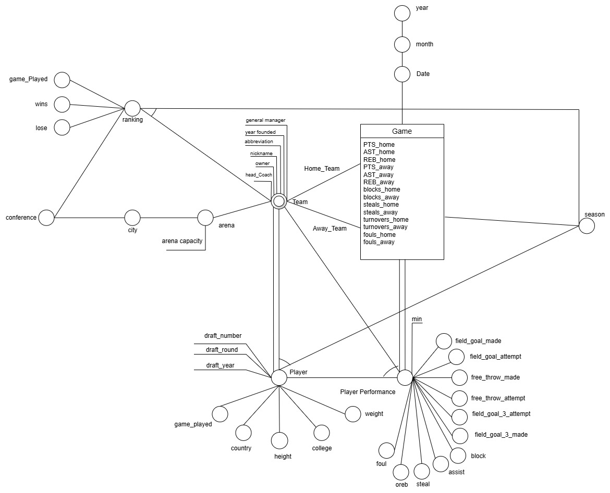
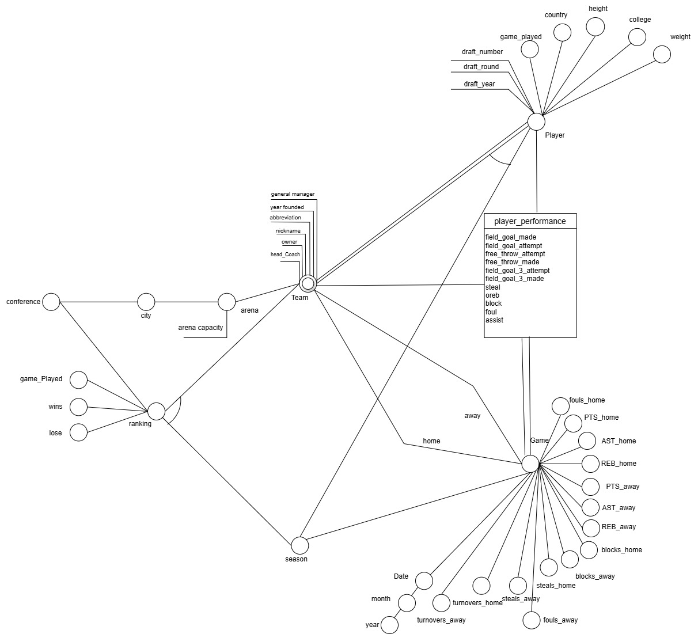
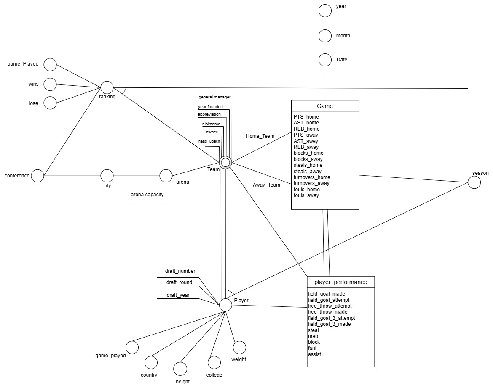

# 🏀 NBA Data Warehouse Project

## 📌 Overview

This NBA Data Warehouse project integrates multiple datasets related to NBA teams, games, players, players performance, dates, and rankings into a **unified analytical environment**. The goal is to facilitate deep and flexible analysis of NBA performance metrics over time, across cities, seasons, and players.

It supports advanced OLAP querying and can be used with BI tools like Tableau for rich data visualization.


## 📦 Data Sources

Data was collected and transformed from:
- Historical NBA game logs
- Player stats (seasonal and per-game)
- Team details and season rankings

|Dataset Name | Dataset Link  |
|--|--|
| NBA Games Data <br> (Games, Game Details, Teams, Rankings, Players) | [Kaggle Link](https://www.kaggle.com/datasets/nathanlauga/nba-games?resource=download&select=games.csv) |
|NBA Players Details|[Kaggle Link](https://www.kaggle.com/datasets/justinas/nba-players-data)|


## 📐 Dimensional Fact Model (DFM)

### Assuming Fact Game


### Assuming Fact Player Performance


### Assuming 2 Facts



**Fact Table:**
- `fact_game`: Central table containing game-level statistics for both teams.

**Dimensions:**
- `dim_team`: Teams, locations, coaches, arenas, etc.
- `dim_season`: Season identifiers.
- `dim_date`: Calendar information.
- `dim_ranking`: Team season performance.
- `dim_player_static`: Player identity and background.
- `dim_player_dynamic`: Player info that changes per season (e.g., weight, team).
- `dim_player_performance`: Player performance stats per game.


## 🔁 ETL Process

The ETL (Extract, Transform, Load) process consolidates multiple raw NBA datasets into a clean, unified PostgreSQL data warehouse.

### 🗃️ Extract

* Source: **CSV files** containing raw data for teams, players, games, rankings, and performance.

### 🛠️ Transform

Key transformation steps include:

* **Remove Duplicates**: Eliminate repeated records to ensure data accuracy.
* **Fill Missing Values**: Apply default values where data is incomplete or null.
* **Map Values to IDs**: Convert string fields (e.g., team names) into foreign key references using lookup tables.
* **Reference Mapping Across Sheets**: Ensure consistent linking between related tables (e.g., players to teams, games to dates).
* **Attribute Standardization**: Normalize column names and formats.
* **Surrogate Key Generation**: Create unique primary keys where necessary (e.g., for performance records).
* **Dimension Mapping**: Align entities across dimensions (e.g., player season data to both player and team).
* **Concatenate Values**: Combine multiple attributes into single dimensions when needed.

### 🛢️ Load

* Load cleaned and transformed data into a **PostgreSQL** database.


## 🔀 Snowflake Schema

The data warehouse follows a **Snowflake Schema**:
- Snowflake branches to player performance and rankings:
  - `dim_player_dynamic` and `dim_player_static` normalize player history.
  - `dim_ranking` adds a secondary analytical axis (team season performance).

## 📊 OLAP Session Queries


### Assuming Fact Game

Below are a set of useful SQL queries for DFM schema where the fact is the Game.

Reference queries: [olap_queries.sql](olap_queries.sql)

1. **Building the full cube across all dimensions**

```sql
SELECT *
FROM fact_game f
JOIN dim_team AS home
  ON f.home_team_id = home.team_id
JOIN dim_team AS away
  ON f.visitor_team_id = away.team_id
JOIN dim_season s
  ON f.season_id = s.season_id
JOIN dim_date d
  ON f.date_id = d.date_id
JOIN dim_ranking r
  ON r.team_id = f.home_team_id
  AND r.season_id = s.season_id
JOIN dim_player_dynamic pd
  ON pd.team_id = f.home_team_id
  AND pd.season_id = s.season_id
JOIN dim_player_static ps
  ON pd.player_id = ps.player_id
JOIN dim_player_performance pp
  ON pp.player_id = pd.player_id
  AND pp.game_id = f.game_id;
```
2. **Roll-up: Average points scored per team per month**
```sql
SELECT
  d.year,
  d.month,
  t.team_id,
  t.abbreviation,
  ROUND(
    AVG(
      CASE
        WHEN f.home_team_id = t.team_id THEN f.home_points
        WHEN f.visitor_team_id = t.team_id THEN f.visitor_points
        ELSE 0
      END
    ), 2
  ) AS avg_points_per_game
FROM fact_game f
JOIN dim_team t
  ON t.team_id IN (f.home_team_id, f.visitor_team_id)
JOIN dim_date d
  ON f.date_id = d.date_id
WHERE d.year > 2003
GROUP BY d.year, d.month, t.team_id, t.abbreviation
ORDER BY avg_points_per_game DESC;
```

3. **DICE: Filter by year and team abbreviation**
```sql
SELECT
  f.game_id,
  d.year,
  home.team_id,
  home.abbreviation AS home_team,
  away.team_id AS away_team,
  away.abbreviation,
  f.home_points,
  f.visitor_points
FROM fact_game f
JOIN dim_team AS home
  ON f.home_team_id = home.team_id
JOIN dim_team AS away
  ON f.visitor_team_id = away.team_id
JOIN dim_date d
  ON f.date_id = d.date_id
WHERE d.year = 2022
  AND (
    home.abbreviation = 'CLE'
    OR away.abbreviation = 'CLE'
  );
```
4. **Retrieve games where a player scored more than 50 points**
```sql
SELECT
  f.game_id,
  ps.player_name,
  t.abbreviation AS team_player,
  pp.points,
  d.date,
  home.abbreviation AS home_team,
  away.abbreviation AS away_team
FROM fact_game f
JOIN dim_team AS home
  ON f.home_team_id = home.team_id
JOIN dim_team AS away
  ON f.visitor_team_id = away.team_id
JOIN dim_date d
  ON f.date_id = d.date_id
JOIN dim_player_performance pp
  ON pp.game_id = f.game_id
JOIN dim_player_static ps
  ON ps.player_id = pp.player_id
JOIN dim_team t
  ON t.team_id = pp.team_id
WHERE pp.points > 50;
```

### Assuming Fact Player Performance

Below are a set of useful SQL queries for DFM schema where the fact is player_performance.

1. **Get the most efficient scorers over a season or over all seasons**
```sql
SELECT s.season_year,
    p.player_name,
    ROUND(AVG(pp.points), 2) AS avg_points_per_game,
    COUNT(DISTINCT pp.game_id) AS games_played
FROM dim_player_performance pp
JOIN dim_player_static p 
  ON p.player_id = pp.player_id
JOIN fact_game f 
  ON f.game_id = pp.game_id
JOIN dim_season s 
  ON s.season_id = f.season_id
WHERE s.season_year = 2022
GROUP BY s.season_year, 
  p.player_name
HAVING COUNT(DISTINCT pp.game_id) >= 10
ORDER BY avg_points_per_game DESC
```

2. **identify players with the best shooting percentages (field goals, 3P, and free throw) in a season / over all seasons.**

```sql
SELECT p.player_name,s.season_year,
    ROUND(AVG(pp.field_goal_percentage::numeric), 2) AS avg_fg_pct,
    ROUND(AVG(pp.three_pointer_percentage::numeric), 2) AS avg_3p_pct,
    ROUND(AVG(pp.free_throw_percentage::numeric), 2) AS avg_ft_pct
FROM dim_player_performance pp
JOIN dim_player_static p 
  ON p.player_id = pp.player_id
JOIN fact_game f 
  ON f.game_id = pp.game_id
JOIN dim_season s 
  ON s.season_id = f.season_id
GROUP BY p.player_name,s.season_year
HAVING COUNT(pp.game_id) >= 15
ORDER BY avg_fg_pct DESC
```

## 📊 Tableau Dashboard

We’ve built an interactive dashboard in Tableau to help you explore the data more deeply. You can view it here:

[🔗 View the Tableau Dashboard](https://public.tableau.com/app/profile/jamil.nassar/viz/Data_Warehouse_NBA/Sheet4)


